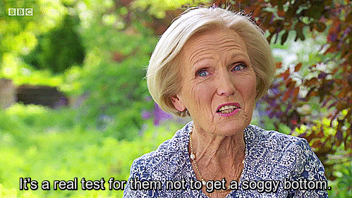

```{r setup, include=FALSE}
library(learnr)
remotes::install_github("apreshill/bakeoff")

library("tidyverse")
library("bakeoff")
knitr::opts_chunk$set(echo = FALSE)


get_constraint <- function(breakout_group_number){
  set.seed(breakout_group_number)
  constraints = c(str_c("Use the colour ", c("blue", "purple", "orange", "red"), " in a visualization."), 
    str_c("Focus on series ", 1:6, " of the show."), 
    "Focus on the age of the contestants.", "Focus on technical ranking.")
  print(sample(constraints,1))
}

```

## The Great British Bake Off

The [Great British Bake Off](https://en.wikipedia.org/wiki/The_Great_British_Bake_Off) is a television show about...well British people baking. It's a competition show where one contestant is eliminated each round. You don't need to know too much about it to try this activity.




## The `bakeoff` package

```{r, echo = FALSE, fig.align='center', caption="bakeoff package hex sticker", alt="Hexagonal logo of the bakeoff package. A teal hexagon with a cupcake with buttercream frosting. The wrapper of the cupcake looks a but like a vertically stacked set of bars (as from a barchart)"}
knitr::include_graphics("images/bakeoff-hex.png")
```

You can find more information about this package and the functions within it [here](https://bakeoff.netlify.app/reference/index.html). It has been developed by [Alison Presmanes Hill](https://alison.rbind.io/), who is the product manager for data science communication at RStudion. This package is a great example of the kind of mostly just-for-fun project you could develop for yourself this summer. Note that learning how to write a package and functions of this kind would be very transferable to other more 'serious' project as well.

The joined tibbles are the main ones I'd recommend working with today. Click on the name of the dataset to learn more about its variables.


### `baker_results` dataset

```{r}
baker_results
```

### `episode_results` dataset

```{r}
episode_results
```

### `challenge_results` dataset

```{r}
challenge_results
```

### `ratings_seasons` dataset

```{r}
ratings_seasons
```


## Introductions [4 minutes]

Give yourself 4 minutes before getting into the activity to meet everyone in your breakout group.

* Name?
* What are you studying?
* What year are you going into in Fall 2021? Graduating?
* What is a BORING fact about you?

## Activity: Explore the data

The hints and solutions for these all use the `tidyverse` package. If you're not familiar with it, you can use whatever you are familiar with. Remember, not a course! Up to you.

If you want to learn more about the `tidyverse`, this is a great resource: [R for Data Science](https://r4ds.had.co.nz/).

### What was contestant Robert Smart's occupation?


```{r robert-smart, exercise=TRUE}

```

```{r robert-smart-hint-1}
# Use this dataset
baker_results
```

```{r robert-smart-hint-2}
# Here is some starter code, complete it to find the answer
baker_results %>% 
  filter()
```

```{r robert-smart-solution}
# Code for solution
baker_results %>% 
  filter(baker_full == "Robert Smart")
```


```{r smart-a, echo=FALSE}
question("What was baker Robert Smart's occupation?",
  answer("Artist"),
  answer("Statistician"),
  answer("Space Satellite Designer", correct = TRUE),
  answer("Mechanic"),
  answer("Retired Naval Officer")
)
```

### Based on 7 day viewership, which episode was the most popular of series 4?

```{r rating, exercise=TRUE}

```

```{r rating-hint-1}
# Use this dataset
ratings_seasons
```

```{r rating-hint-2}
# Here is some starter code, complete it to find the answer
# Note: there are lots of OTHER ways you could get to the answer to!
ratings_seasons %>% 
  ______(series == 4) %>% 
  _______(desc(viewers_7day))
```

```{r rating-solution}
ratings_seasons %>% 
  filter(series == 4) %>% 
  arrange(desc(viewers_7day))

# Note, there are lots of different ways you could get this answer! Below is another
ratings_seasons %>% 
  filter(series == 4) %>% 
  filter(viewers_7day == max(viewers_7day))

```

```{r rating-a, echo=FALSE}
question("Based on 7 day viewership, which episode was the most popular of series 4?",
  answer("Episode 1"),
  answer("Episode 2"),
  answer("Episode 4"),
  answer("Episode 6"),
  answer("Episode 9"),
  answer("Episode 10", correct = TRUE)
)
```

### Modify this viz 

1. Find out which seasons had the most/least signature dishes with __orange__ in the title (instead of chocolate)
2. Change the colours of the visualization to be dodgerblue and darkorange1    
3. Change the title and other text to be appropriate for your new graph.

```{r viz, exercise = TRUE}
challenge_results %>% 
  left_join(ratings_seasons, by = c("series", "episode")) %>% 
  filter(!is.na(signature)) %>% 
  mutate(ingedient_in_title= str_detect(signature, "Chocolate")) %>% 
  ggplot(aes(x = as.factor(series), 
             group = ingedient_in_title, 
             fill = ingedient_in_title)) +
  geom_bar(position = "fill") +
  theme_minimal() +
  scale_fill_manual(values = c("goldenrod1", "saddlebrown")) +
  labs(title = "Which series of the Great British Bake Off is the most chocolate-y?",
       subtitle = "Based on the titles of signature dishes.",
       y = "Proportion of signature dishes",
       x = "Series",
       fill = "Chocolate?",
       caption = "Created by <your name/your group>
       Data from the bakeoff package: https://bakeoff.netlify.app
       #ISSC21")
```

```{r viz-solution}
# example solution
challenge_results %>% 
  left_join(ratings_seasons, by = c("series", "episode")) %>% 
  filter(!is.na(signature)) %>% 
  mutate(ingedient_in_title= str_detect(signature, "Orange")) %>% 
  ggplot(aes(x = as.factor(series), 
             group = ingedient_in_title, 
             fill = ingedient_in_title)) +
  geom_bar(position = "fill") +
  theme_minimal() +
  scale_fill_manual(values = c("dodgerblue", "darkorange1")) +
  labs(title = "Orange you glad? Great British Bake Off signature dishes",
       subtitle = "Signature dishes including orange in the title.",
       y = "Proportion of signature dishes",
       x = "Series",
       fill = "Orange?",
       caption = "Created by the ISSC team
       Data from the bakeoff package: https://bakeoff.netlify.app
       #ISSC21")
```

## Activity: Mini-project

Just like cooking and baking competition shows usually have a theme or challenge ingredient for each episode, so to will your group.

```{r constraint, exercise=TRUE}
# Add your breakout group number* below and run the code to get your constraints.
get_constraint()
```

*If you are doing this activity by yourself after the event, just put in your favourite number.


```{r challenge, exercise=TRUE, exercise.lines=15}
# Your turn!
```

If you want to save your visualization you should be able to right click and choose "Save Image As..." 

Want to share your work? Use hastag #ISSC21, and if you're using Twitter, tag us on @UoftStatSci.

Don’t worry if didn't finish! Come to the [TidyTuesday and Talk tomorrow](https://utoronto.sharepoint.com/sites/ArtSci-STA/ISSC/_layouts/15/Event.aspx?ListGuid=0679786c-8a7e-483c-9ec5-3845602a70e5&ItemId=15) to ask questions, show us what you did or just hang out.

## Appendix: Code

If you would rather work in R locally or in an R Notebook on the JupyterHub, below is the code to get you started.

```{r, echo = TRUE, eval = FALSE}
# if you aren't using the JupyterHub and/or don't have tidyverse installed, 
# make sure you run the commented line of code below
# install.packages("tidyverse")
library("tidyverse")

remotes::install_github("apreshill/bakeoff")
library("bakeoff")


get_constraint <- function(breakout_group_number){
  set.seed(breakout_group_number)
  constraints = c(str_c("Use the colour ", c("blue", "purple", "orange", "red"), " in a visualization."), 
    str_c("Focus on series ", 1:6, " of the show."), 
    "Focus on the age of the contestants.", "Focus on technical ranking.")
  print(sample(constraints,1))
}

#### Add your favourite number if you're not doing this in a breakotu room
get_constraint()


### Activity

#### What was baker Robert Smart's occupation?

baker_results %>% 
  filter(baker_full == "Robert Smart")

#### Based on 7 day viewership, which episode was the most popular of series 4?

ratings_seasons %>% 
  filter(series == 4) %>% 
  arrange(desc(viewers_7day))

# Note, there are lots of different ways you could get this answer! Below is another
ratings_seasons %>% 
  filter(series == 4) %>% 
  filter(viewers_7day == max(viewers_7day))

#### Signature dish viz

challenge_results %>% 
  left_join(ratings_seasons, by = c("series", "episode")) %>% 
  filter(!is.na(signature)) %>% 
  mutate(ingedient_in_title= str_detect(signature, "Chocolate")) %>% 
  ggplot(aes(x = as.factor(series), 
             group = ingedient_in_title, 
             fill = ingedient_in_title)) +
  geom_bar(position = "fill") +
  theme_minimal() +
  scale_fill_manual(values = c("goldenrod1", "saddlebrown")) +
  labs(title = "Which series of the Great British Bake Off is the most chocolate-y?",
       subtitle = "Based on the titles of signature dishes.",
       y = "Proportion of signature dishes",
       x = "Series",
       fill = "Chocolate?",
       caption = "Created by <your name/your group>
       Data from the bakeoff package: https://bakeoff.netlify.app
       #ISSC21")

# example solution
challenge_results %>% 
  left_join(ratings_seasons, by = c("series", "episode")) %>% 
  filter(!is.na(signature)) %>% 
  mutate(ingedient_in_title= str_detect(signature, "Orange")) %>% 
  ggplot(aes(x = as.factor(series), 
             group = ingedient_in_title, 
             fill = ingedient_in_title)) +
  geom_bar(position = "fill") +
  theme_minimal() +
  scale_fill_manual(values = c("dodgerblue", "darkorange1")) +
  labs(title = "Orange you glad? Great British Bake Off signature dishes",
       subtitle = "Signature dishes including orange in the title.",
       y = "Proportion of signature dishes",
       x = "Series",
       fill = "Orange?",
       caption = "Created by the ISSC team
       Data from the bakeoff package: https://bakeoff.netlify.app
       #ISSC21")

```


